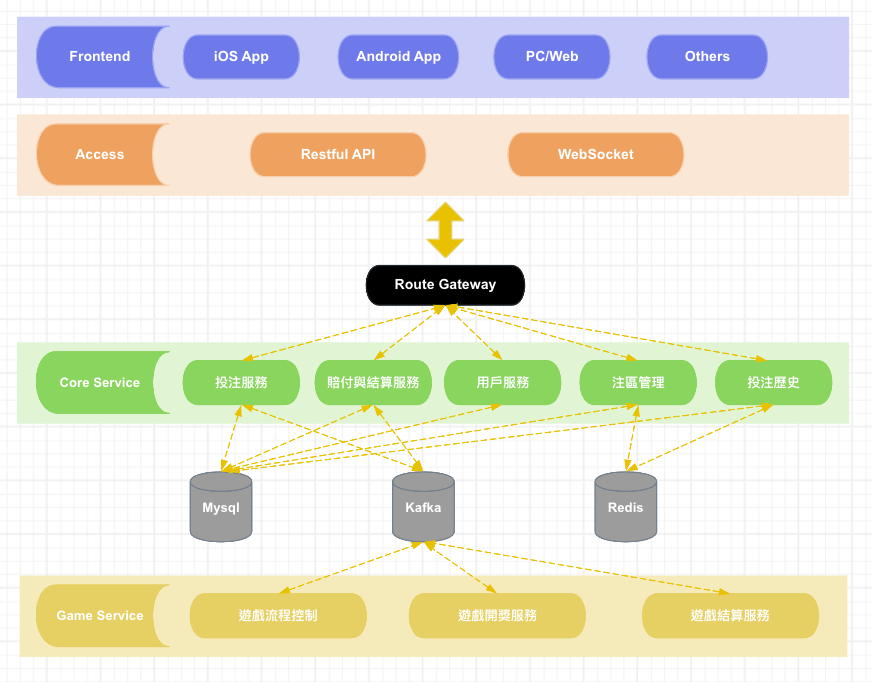
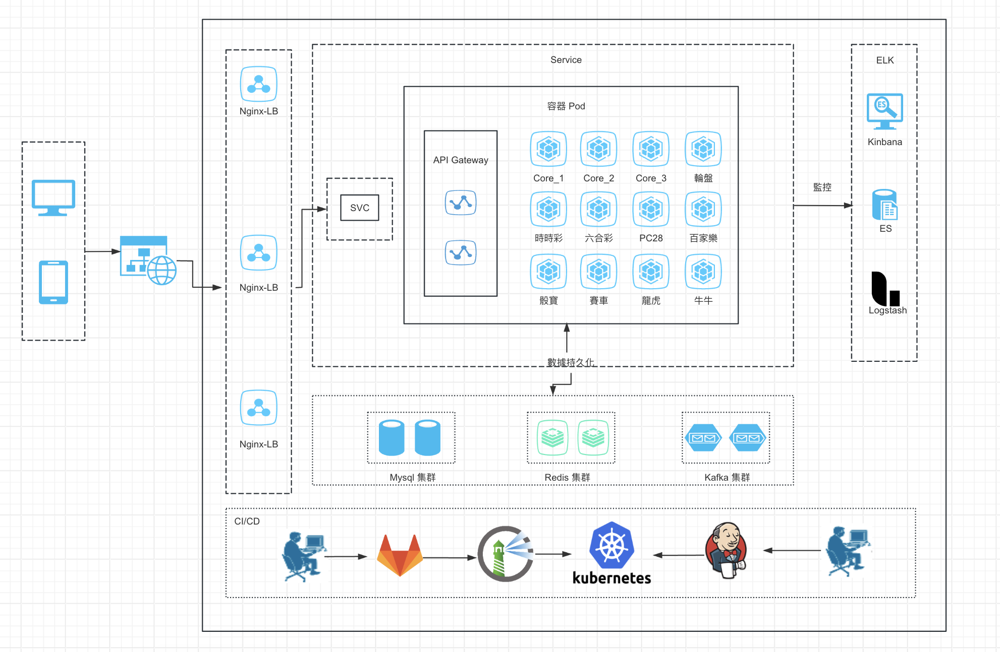

## 簡要介紹
本專案是基於 Golang (gorilla websocket + 自製 game framework) 開發的｜遊戲後端｜投注系統｜骰寶｜賽車｜時時彩｜六合彩｜PC28｜百家樂｜龍虎｜牛牛｜輪盤
- 核心系統 (投注｜結算｜注區詳情｜投注歷史)
- 注區管理 (賠率｜限紅)
- 遊戲大廳 (骰寶｜賽車｜時時彩｜六合彩｜PC28｜百家樂｜龍虎｜牛牛｜輪盤)
- 遊戲房 (遊戲階段迭代｜倒數計時｜投注金與人數動態刷新｜開牌展示｜路圖｜遊戲切換)

## 系統架構概要
#### 整體架構

#### 部署架構

## 技術構成
- 後端：Gorilla、Golang Game Framework
- 資料庫：Mysql
- 緩存：Redis
- 消息隊列：Kafka
- 前端：iOS、Android

## 關於自製 Game Framework
這是一款自製輕量級、高效能的 Golang Web Socket 框架，適用於構建高併發、低延遲的遊戲應用。
Framework 採用 樹路由 與 middleware 機制，提供卓越的請求處理性能。
### 核心特性
- 中間層機制：支持 Middleware 鏈式調用，方便請求攔截、日誌記錄、權限驗證、錯誤處理等功能擴展，提升可維護性
- 靈活路由：支援 動態路由、路由分組、參數綁定，確保請求處理高效且靈活，適應不同遊戲場景需求
- 錯誤處理：內建 統一錯誤捕獲與恢復機制，可自訂錯誤處理策略，確保應用穩定運行，防止異常影響遊戲流程
- 資料處理：內建高效資料解析器與協議，可依需求自行實作解析器。
- 頻道管理：支持單播、群組廣播、房間內消息分發，適用於遊戲房間、即時聊天、數據推送等場景
- 連接管理：支援自動重連、心跳機制、連線超時檢測，確保遊戲過程不中斷
- 安全性：內建身份驗證、加密傳輸，確保通訊安全，防止惡意攻擊
- 高效消息推送：內建異步消息處理與事件驅動機制，支援 多人同步數據、遊戲狀態更新、實時通知

## 文件目錄說明
**core**

└─———adapter   適配層

└─———cache   緩存層

└─———controller   控制器

└─———factory   工廠層

└─———game    遊戲數據處理核心

└─———model   資料層

└─———queue   數據隊列層

└─———repository   資料庫存取層

└─———router   路由層

└─———service   業務層

**mini_game**

└─———baccarat   百家樂

└─———─———─———factory   工廠層

└─———─———─———manager   遊戲管理

└─———─———─———service   業務層

└─———fast_three   快三

└─———long_hu   龍虎

└─———niu_nit   牛牛

└─———pc28   PC28

└─———racing car   賽車

└─———roulette   輪盤

**shared**

└─———game   小遊戲數據處理引擎

└─———mini_game   小遊戲底層基礎架構

└─———model   共用數據模型

└─———pkg   第三方工具封裝

└─———queue   共用消息隊列層

└─———req   api 請求 proto 模型

└─———res   api 響應 proto 模型

## 核心功能說明 (Core)

- [x] 1.投注 (實時投注數據同步 / 投注撤銷與異常處理 / 投注成功 / 失敗回應處理)
- [x] 2.風控機制 (高額投注提醒 / 可疑行為偵測)
- [X] 3.反水 / 返點計算 (VIP 返水/活動返水)
- [X] 4.結算 (交易日誌紀錄/異常處理/賠率計算/開獎結果)
- [X] 5.注區詳情 (賠率與限紅/投注人數與投注總額展示/注區金額動態刷新)

## 遊戲功能說明 (mini_game)

- [x] 1.遊戲階段迭代（開盤、封盤、結算、等待 / 不同遊戲的專屬開局流程）
- [X] 2.開牌展示 (不同遊戲的開獎動畫與展示方式 / 遊戲結果計算與同步 / 可視化的開獎結果)
- [X] 3.路圖 (百家樂、龍虎、輪盤等遊戲的歷史記錄圖表)
- [X] 4.投注金與人數動態刷新 (即時更新注區的投注總額/不同玩家投注變動時的數據同步)